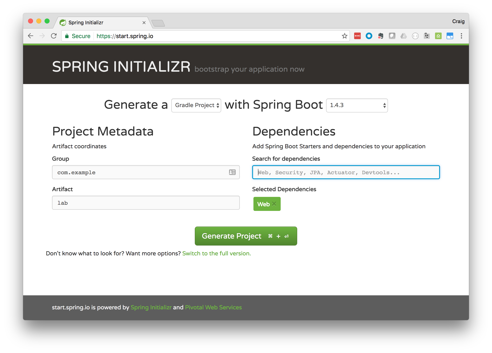
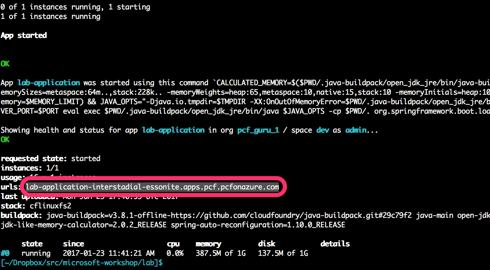

# Developing Applications with Spring Boot and Spring Cloud

*Modified from original content by [Andrew Ripka](https://github.com/aripka-pivotal)*

## High Level Objectives
* Spring Boot project creation (Lab 1)
* Spring Actuator (Lab 1)
* Learn how to deploy an app to Pivotal Cloud Foundry (Lab 2)

## Contents

* [Prerequisites](#prerequisites)
* [Labs](#labs)
  * [Lab 1](#lab-1)
  * [Lab 2](#lab-2)

## Prerequisites

Helpful knowledge:
* Spring Framework/Core
* Spring Web

Your local environment:
* [Java](http://www.oracle.com/technetwork/java/javase/downloads/index.html) (Be sure to download and install the **JDK**, not the JRE.)
* An IDE
  * [Spring Tool Suite](https://spring.io/tools)
  * [IntelliJ IDEA](https://www.jetbrains.com/idea/)
  * [Atom](https://atom.io/)
* [Gradle](https://gradle.org/gradle-download/)
* [Chrome](https://www.google.com/chrome/)
  * [Postman Plugin](https://www.getpostman.com/docs/introduction)
  * [JSON Formatter Plugin](https://chrome.google.com/webstore/detail/json-formatter/bcjindcccaagfpapjjmafapmmgkkhgoa)
* [Pivotal Cloud Foundry](http://pivotal.io/platform)
  * Instructor Provided
  * [Deploy](http://blog.erds.xyz/technology/install-cloud-foundry-on-azure/) your own platform
  * Sign up with [Pivotal Web Services](http://run.pivotal.io/)
* [Cloud Foundry CLI](https://github.com/cloudfoundry/cli/releases)

## Labs

### Lab 1

#### Objectives

* Learn how to create a simple Spring Boot application
* Leverage Spring Boot Actuator

#### Steps

1. Use Spring Initializer to generate a project
  * Visit the [Spring Initializer](https://start.spring.io/) site:
    
  * Fill out the form as follows:
    * **Generate a**: Select - *Gradle Project*
    * **with Spring Boot**: Select - *1.4.3*
    * **Group**: *com.example*
    * **Artifact**: *lab*
    * **Search for dependencies**: Type *Web* and hit Enter
  * Click on **Generate Project**. This will generate and download a zip file containing the skeleton of this Spring Boot app.
  * Unzip it into a local folder
1. Start up your favorite IDE and import the *build.gradle* file found in the root of the lab folder
1. Under **Main** -> **java** -> **com.example**, create a new java class named *HelloController*
1. Type or paste in the following code:
  ```java
  package com.example;

  import org.springframework.web.bind.annotation.RestController;
  import org.springframework.web.bind.annotation.RequestMapping;

  @RestController
  public class HelloController {

    @RequestMapping("/")
    public String index() {
      return "Greetings from the Spring Boot Starter App!";
    }
  }
  ```
1. Open up a terminal window or command prompt and navigate to root of the folder you downloaded from Spring Initializer.
1. Depending on your operating system, perform one of the following to start the application:
  * Mac/Linux: ```./gradlew bootRun```
  * Windows: ```gradlew bootRun```
1. The Spring Initializer sets the port to 8080. Therefore, visit: [localhost:8080](http://localhost:8080) to view the output from your endpoint. You should see: ```Greetings from the Spring Boot Starter App!```
1. Now we are going to add Spring Boot Actuator for production-grade monitoring and information:
  * Open up the *build.gradle* file found at the root of your *lab* folder
  * Under dependencies, add the Actuator dependency. When you are done, the section should look like this:

    ```
    dependencies {
      compile('org.springframework.boot:spring-boot-starter-web')
      compile('org.springframework.boot:spring-boot-starter-actuator')
      testCompile('org.springframework.boot:spring-boot-starter-test')
    }
    ```

1. Restart your application at the command line using one of the *bootRun* commands in the above step
1. Ensure that it compiles and starts and then refresh the [localhost:8080](http://localhost:8080/) page to ensure it still works
1. Visit some of the Actuator endpoints to see the available metrics and information (This is where the JSON Formatter plugin comes in handy)
  * [localhost:8080/info](http://localhost:8080/info)
  * [localhost:8080/health](http://localhost:8080/health)
  * [localhost:8080/metrics](http://localhost:8080/metrics)
  * [localhost:8080/env](http://localhost:8080/env)

### Lab 2

#### Setup

* Ensure you have installed the [Cloud Foundry CLI](https://github.com/cloudfoundry/cli/releases)
* Know the *api* endpoint for the Pivotal Cloud Foundry you are targeting. It will typically look like this: ```https://api.system.pcf.pcfonazure.com```, and will be referenced in this lab as [PCF-API endpoint]
* Know the Pivotal Cloud Foundry *Apps Manager* endpoint to view the status of your apps in your browser. It will typically look like this: ```https://apps.system.pcf.pcfonazure.com```, and will be referenced in this lab as [PCF Apps Manager endpoint]
* Know your Pivotal Cloud Foundry username. It will be referenced in this lab as [PCF username]
* Know your Pivotal Cloud Foundry users password. It will be referenced in this lab as [PCF password]

#### Objectives

* Learn how to deploy an application to Pivotal Cloud Foundry

#### Steps

1. In your terminal, set the PCF-API endpoint in the Cloud Foundry CLI

    ```
    cf api [PCF-API endpoint] --skip-ssl-validation
    ```

    i.e.

    ```
    cf api https://api.system.pcf.pcfonazure.com --skip-ssl-validation
    ```

1. Login to Pivotal Cloud Foundry:

    ```
    cf login
    ```

    Follow the prompts to enter your [PCF username] and [PCF password]. When prompted for your space, select *dev*

1. Login to the Pivotal Cloud Foundry Apps Manager for a GUI view of your applications. In your browser, navigate to: [PCF Apps Manager endpoint]. Enter your [PCF username] and [PCF password] and explore the Apps Manager. Discover:
    * My Account
    * Quotas
    * Orgs and Spaces
    * Marketplace
    * Docs
    * Tools
    * Domain
    * Members
1. Jump back over to the terminal and push your app to Pivotal Cloud Foundry
    * In your terminal navigate to the root of your *lab* application that you setup in [Lab 1](#lab-1)
    * Since we previously ran the application with ```gradlew bootRun```, there will be a fat JAR file (a single artifact with bundled dependencies) in the ```./build/libs``` directory.
    * Execute the push:

      ```
      cf push lab-application --random-route -i 1 -p ./build/libs/lab-0.0.1-SNAPSHOT.jar
      ```

      Note: execute ```cf push``` with no parameters to see what the parameters for cf push mean. Also, we are using the ```--random-route``` parameter. Pivotal Cloud Foundry will create a route for your app based on the domain of the org and the application name. If you are executing this lab in a classroom with other students, then the first student to execute the push will claim the route and everyone else will error out. Random route ensures each student will have a unique route for their app.
1. Test drive your new app
    * Get the route to your app from the output of the ```cf push```:
      
    * Enter the route in your browser. You should see the same result from Lab 1: ```Greetings from the Spring Boot Starter App!```
    * Think about the things that you didn't have to do:
      * You didn't provision a VM
      * You didn't install an application runtime
      * You didn't deploy an application to a VM or container
      * You didn't configure a load balancer
      * You didn't configure ssl termination
      * You didn't configure a firewall
1. Test drive some other *cf* commands
    * ```cf app lab-application```
    * ```cf scale lab-application -i 2```

      The *scale* command scales your application to 2 instances. In addition to the tasks above that you didn't have to worry about, you also didn't have to reconfigure your load balancer and update routes
    * ```cf events lab-application```
    * ```cf logs lab-application --recent```
    * ```cf restart lab-application```
    * ```cf restage lab-application```
1. View your app in the Apps Manager
    * Switch to your browser and refresh the Apps Manager. You should see your application in the dev space. You will notice that many of the options available to you on the command line are available in the gui. Discover:
      * Routes
      * Logs
      * Settings
      * Scaling
      * Environment Variables
      * Settings
      * Metrics via PCF Metrics (link found in the *Status* pane)
1. Create a manifest for your application
    * We create manifests to capture the parameters of ```cf push```. We can have different manifests depending on the environment to which we are pushing, or use it to simplify what we have to enter on the command line
    * In your terminal or IDE create a file at the root of the *lab* application named ```manifest.yml```
    * Add the following contents to the file:

      ```
      ---
      applications:
      - name: lab-application
        random-route: true
        memory: 512M
        disk: 1G
        instances: 2
        path: ./build/libs/lab-0.0.1-SNAPSHOT.jar
      ```

    * At your command line, make sure you are in the root of the *lab* application, and execute ```cf push```. Note that *cf* found the manifest file and didn't require any command line parameters
